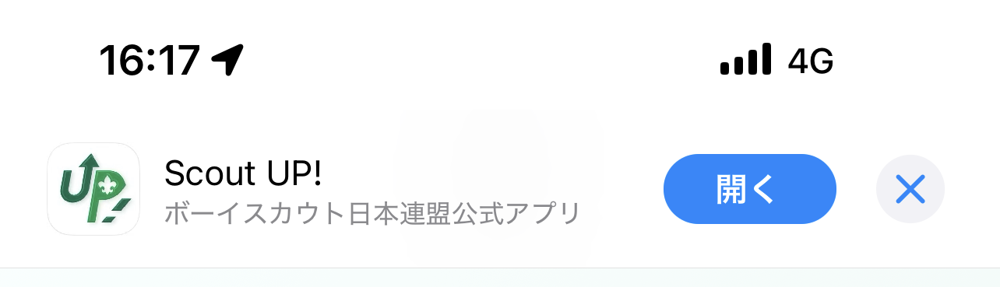
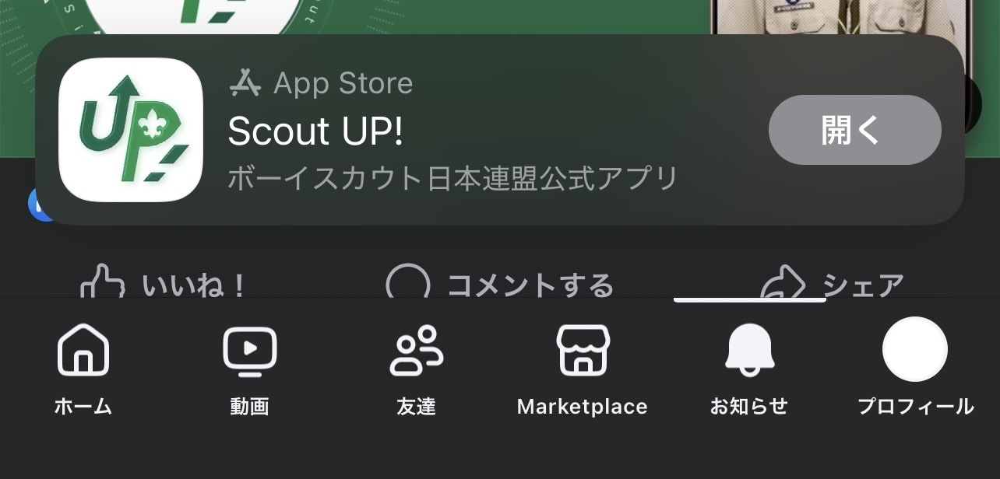

# Facebookで App Store / Google Play のアプリ表示回数を上げるApp Bannerの設定方法

## ⭐️ この記事の目的
アプリを作ったら「できるだけ多くの人にインストールしてもらいたい」「目に触れる数を増やしたい」と思いますよね。  
そのために有効なのが **App Banner（アプリバナー）** です。  
App Store / Google Playの直接リンクをSNSに投稿する場合は必要ないのですが、ユーザー分析ツールを入れたかったり、広報観点で単一のリンクでios/Andoridを判定し各アプリダウンロードをさせることもあるかと思います。
その際に、headerに追記があるとよりApp Bannerを表示させやすくなり、アプリへのタッチポイントを増やすことができます。

この記事では **header にタグを埋め込むだけで各SNSやブラウザにアプリ導線を増やすことができる方法** を、わかりやすく解説します。

---

## 1. App Banner とは？
- **Safari（iOS）**  
  ページ上部に「アプリを開く / App Store」バーが出ます。  


- **Facebook**  
  投稿下に「開く / インストールバー」が自動で出ます。  


👉 つまり「正しくタグを埋め込む」と **アプリへの導線が自動生成** される仕組みです。

---

## 2. 必要な準備
1. **iOS アプリの App Store ID** を確認  
   - 例: `1234567890`  
2. **Android アプリのパッケージ名** を確認  
   - 例: `com.example.app`  
3. サイトの `<head>` にタグを埋め込む  

---

## 3. コピペできるコード例

```html
<header>

<!-- iOS Safari Smart App Banner -->
<!-- app-argumentは、URLスキーム（例: paypay://home）や 単一のインストールWebリンク -->
<meta name="apple-app" content="app-id=1234567890, app-argument=myapp://home">

<!-- Facebook / Instagram 用 App Links -->
<meta property="al:ios:app_store_id" content="1234567890">
<meta property="al:ios:app_name" content="アプリ名">
<meta property="al:ios:url" content="myapp://home">
<meta property="al:android:package" content="com.example.app">
<meta property="al:android:app_name" content="アプリ名">
<meta property="al:android:url" content="myapp://home">
<meta property="al:web:url" content="https://example.com/">

<!-- 今回の範囲外だが、設定推奨 -->
<!-- OGP（Facebook / Instagram / LINE） -->
<meta property="og:title" content="アプリ名 - キャッチコピーや説明文">
<meta property="og:description" content="アプリの簡単な紹介文を入れる。iOS/Android対応。">
<meta property="og:image" content="https://example.com/ogp.jpg">
<meta property="og:url" content="https://example.com/">

<!-- Twitter (X) カード -->
<meta name="twitter:card" content="summary_large_image">
<meta name="twitter:title" content="アプリ名 - キャッチコピーや説明文">
<meta name="twitter:description" content="アプリの紹介文を入れる。">
<meta name="twitter:image" content="https://example.com/ogp.jpg">

</header>
